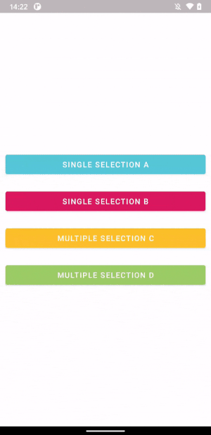
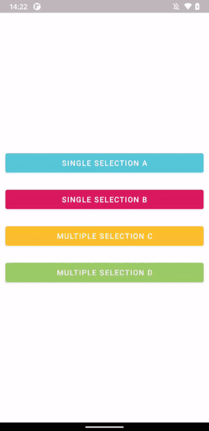
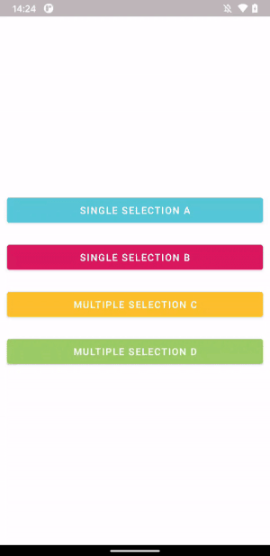

# RecyclerPickerDialog

A FragmentDialog implemented with RecyclerView that can accept Single or Multiple selections

## Installation

RecyclerPickerDialog is distributed through [Maven Central](https://search.maven.org/artifact/com.github.guilhe/recycler-picker-dialog), [Jcenter](https://bintray.com/gdelgado/android/RecyclerPickerDialog) and [Jitpack](https://jitpack.io/#GuilhE/RecyclerPickerDialog).

```groovy
implementation 'com.github.guilhe:recycler-picker-dialog:${LATEST_VERSION}'
```
[](https://search.maven.org/search?q=g:com.github.guilhe%20AND%20recycler-picker-dialog) [](https://bintray.com/gdelgado/android/RecyclerPickerDialog/_latestVersion) 

## Usage

### Selection types
```kotlin
enum class SelectionType { SINGLE, MULTIPLE }
```

### Selector types
```kotlin
enum class SelectorType { CHECK_BOX, RADIO_BUTTON, SWITCH }
```
 
### Custom fields (and default values)
```kotlin
var title = ""
var showSearchBar = false
var inputHint = ""
var buttonText: String = "Ok"
var resetValuesOnShow = true
var dismissKeyboardOnSelection = true
var dismissOnSelection = false
var isChoiceMandatory = false
var data: ArrayList<Item> = arrayListOf()
@AnimRes var itemsLayoutAnimator: Int? = null
var dialogHeight: Int = ViewGroup.LayoutParams.MATCH_PARENT
var lifecycleOwner: LifecycleOwner? = null
```

### Avoid Memory Leaks
Just add the following line to avoid memory leak if not dismissed before activity or fragment are destroyed:
```kotlin
picker.newInstance(/* setup... */).apply { lifecycleOwner = this@MainActivity }
```
    
### Themes

   
  

To override default theme just create yours by simply extending it and replacing desired color values:  
```xml
<style name="DialogA" parent="RecyclerPickerDialogTheme">
    <item name="colorPrimary">@color/red</item>
    <item name="recyclerPickerDialogCornerRadius">20dp</item>
</style>
```

#### Attributes
You can override the following attributes:
```xml
<resources>
    <style name="RecyclerPickerDialogTheme" parent="Theme.MaterialComponents.Light.Dialog">
        <item name="colorPrimary"/>
        <item name="colorOnPrimary"/>
        <item name="colorSecondary"/>
     
        <item name="android:textColorPrimary"/>
        <item name="android:textColorSecondary"/>

        <item name="colorAccent"/>
        <item name="android:colorEdgeEffect"/>
        <item name="recyclerPickerDialogCornerRadius"/>
    </style>
</resources>
```
Where:

- _colorPrimary_ > Title and Button background color
- _colorOnPrimary_ > Title and Button text color
- _colorSecondary_ > Dialog and Row background color
- _colorEdgeEffect_ > RecyclerView edge color
- _textColorPrimary_ > Search and Row text color
- _textColorSecondary_ > Search hint and icon color; Horizontal Lines color
- _colorSurface_ > CheckBox, RadioButton and Switch unchecked color
- _colorOnSurface_ > Button background when disabled (__note__ overrides _colorSurface_)
- _colorAccent_ > CheckBox, RadioButton and Switch checked color; Hint cursor color
- _recyclerPickerDialogCornerRadius_ > Dialog corners radius

## Creating new instance:
```kotlin
val picker = 
    RecyclerPickerDialogFragment
        .newInstance(
            type = SelectionType.SINGLE, //default
            selector = SelectorType.CHECK_BOX, //default
            theme = R.style.RecyclerPickerDialogTheme, //default
            onItemsPicked = { selected -> /* selected items or empty */ }
        )
        .apply {
            /* configure custom fields */ 
        }
```

Show it when desired:
```kotlin
picker.show(supportFragmentManager, "MyPickerDialogFragment")
```

Try out the __sample app__ to see it working!

## Dependencies

- [androidx.appcompat:appcompat](https://developer.android.com/jetpack/androidx/releases/appcompat)
- [androidx.recyclerview:recyclerview](https://developer.android.com/jetpack/androidx/releases/recyclerview)
- [androidx.constraintlayout:constraintlayout](https://developer.android.com/jetpack/androidx/releases/constraintlayout)
- [com.google.android.material:material](https://github.com/material-components/material-components-android/releases)

## Bugs and Feedback

For bugs, questions and discussions please use the [Github Issues](https://github.com/GuilhE/RecyclerPickerDialog/issues).

## LICENSE

Copyright (c) 2020-present GuilhE

Licensed under the Apache License, Version 2.0 (the "License");
you may not use this file except in compliance with the License.
You may obtain a copy of the License at

<http://www.apache.org/licenses/LICENSE-2.0>

Unless required by applicable law or agreed to in writing, software
distributed under the License is distributed on an "AS IS" BASIS,
WITHOUT WARRANTIES OR CONDITIONS OF ANY KIND, either express or implied.
See the License for the specific language governing permissions and
limitations under the License.
